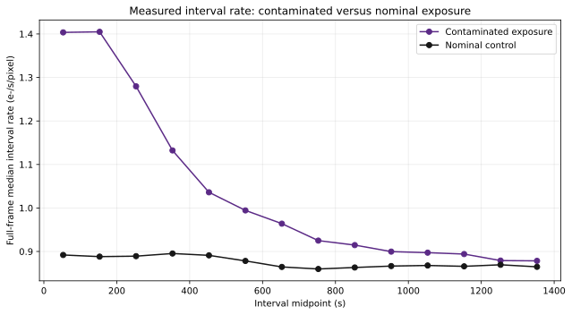
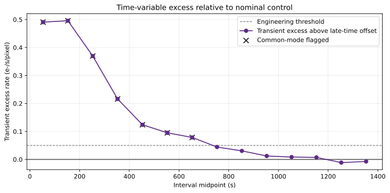
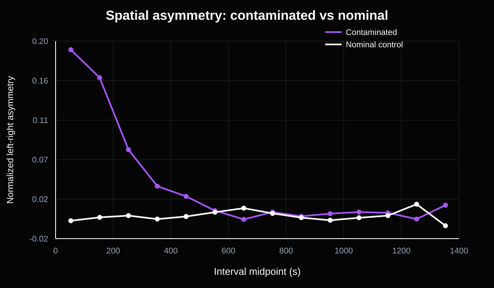

# Case 001 — WFC3/IR HgCdTe ramp anomaly diagnosis

## Engineering question

Can read-level detector diagnostics identify which intervals of a nondestructive HgCdTe ramp are contaminated, quantify the spatial signature, and show why a single fitted count-rate image is insufficient?

## Real data

This case uses two public WFC3/IR exposures from HST program 14037, visit BB:

- `icqtbbbxq_ima.fits`: strong time-variable Earth-limb scattered-light contamination;
- `icqtbbc0q_ima.fits`: nominal comparison exposure from the same visit.

The pair is used by the official STScI WFC3/IR IMA visualization tutorial. Exact MAST product URIs, local byte counts, and SHA-256 hashes are recorded in `data/manifest.csv` and `data/raw/inventory.json`.

## Measured results

Both products contain 16 calibrated reads, producing 14 positive-time read intervals after chronological sorting.

| Metric | Contaminated exposure | Nominal control |
|---|---:|---:|
| Reads | 16 | 16 |
| Read intervals analyzed | 14 | 14 |
| Spatially flagged intervals | 3 | 0 |
| Maximum absolute left-right asymmetry | 19.04% | 1.83% |
| Median interval rate | 0.9435 e-/s/pixel | 0.8687 e-/s/pixel |

The control-relative analysis produced the following additional findings:

- intervals 0–2 show a strong spatial signature;
- intervals 0–6 exceed the provisional common-mode threshold of `0.05 e-/s/pixel`;
- the common-mode excess persists for approximately `700.0 s`;
- peak transient excess is `0.3264 e-/s/pixel`;
- integrated positive transient excess is `146.25 e-/pixel`;
- this excess equals `11.93%` of the nominal control's integrated charge over the analyzed intervals;
- the late-time exposure-to-exposure offset is `0.01919 e-/s/pixel` and is removed before transient classification.







The important distinction is that the obvious left-right distortion is concentrated in the first three intervals, while a lower-amplitude common-mode excess remains detectable through interval 6. A spatial-symmetry test alone would therefore understate the duration of the transient background.

## Detector-level method

For each calibrated read, cumulative charge is reconstructed as

\[
Q_i(x,y)=R_i(x,y)t_i,
\]

and the interval rate is

\[
\dot Q_i(x,y)=\frac{Q_i(x,y)-Q_{i-1}(x,y)}{t_i-t_{i-1}}.
\]

The workflow then:

1. sorts IMA extensions into chronological order;
2. removes edge regions and pixels carrying nonzero data-quality flags;
3. computes sigma-clipped full-frame, left-half, and right-half interval medians;
4. quantifies normalized left-right asymmetry;
5. flags spatial anomalies using a fixed asymmetry criterion and robust z-scores;
6. subtracts the nominal-control interval rate and a late-time static offset;
7. classifies the remaining transient excess using an explicit engineering threshold.

## Reproduce

```bash
python -m venv .venv
# Linux/macOS
source .venv/bin/activate
# Windows PowerShell
# .venv\Scripts\Activate.ps1

python -m pip install -e ".[dev]"
python scripts/download_case_001.py
python scripts/run_case_001.py
```

The two raw IMA files total `336,522,240 bytes` and are intentionally excluded from Git. The downloader verifies that each product is FITS data and writes the reproducibility inventory.

## Committed outputs

```text
data/raw/inventory.json
data/derived/scattered_interval_summary.csv
data/derived/nominal_interval_summary.csv
data/derived/exposure_comparison.csv
data/derived/case_summary.json
figures/control_comparison.svg
figures/transient_excess.svg
figures/spatial_asymmetry_comparison.svg
report/draft_findings.md
```

## Interpretation boundary

This case diagnoses contamination in measured detector ramps. It does not establish a defect in the underlying HgCdTe material. The `0.05 e-/s/pixel` common-mode threshold is a transparent provisional engineering criterion, not an official WFC3 pipeline threshold. A production conclusion should include threshold sensitivity, source-background modeling, and comparison with reprocessed FLT products after read rejection.
